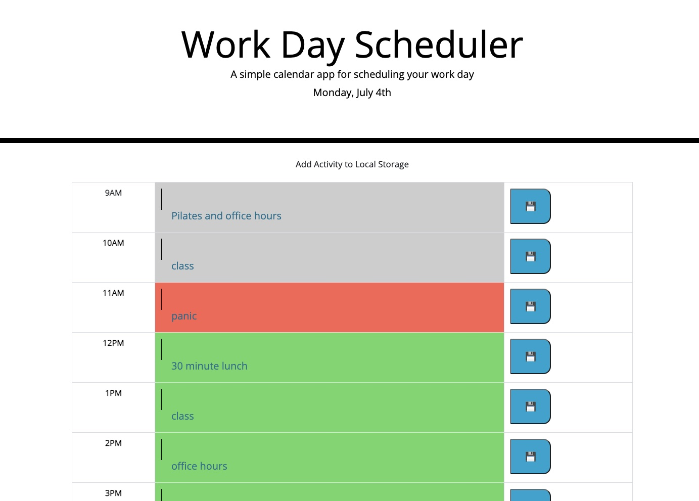

## work-project-scheduler

## Project Description

HTML and CSS starter code was provided for this project which also included links to jquery, moments.js, bootstrap and font styling. This project entailed identifying and adding several HTML elements and then linking the elements with the corresponding css id/class. Bootstrap was permitted during this project, so after a table was identified that roughly fit the end criteria, slight edits were made to the table that was employed. The bulk of this project revolved around JavaScript for which there was no starter code. 

## How to Run
Go to site: https://smariagomez.github.io/work-project-scheduler/

## How to Use

First, the user opens the browser to the deployed site. The application will open to a daily planner with nine time slots (9AM-5PM). Each time slot allows for text input where teh user can type in their intended activity for that hour. Once the save button is pressed a header will briefly alert the user that their input has been stored locally. The application will not respond if the user attempts to use the save button without typing anything into the input. When the browser is refreshed or closed and reopened the time slots will reflect the previously entered tasks. Rows for time slots that have passed will transition to gray, the current time slot will transition to red and future time slots will remain green. 

## Known Bugs/Possible Future Edits

Selecting a bootstrap grid versus a table would likely have made styling and adjusting easier. Input not edited to add new entries to exsisting activities already within the time slot. For instance, if user initially typed "Pilates" in the 9AM time slot and then wanted to add on "office hours," the user would have to type "Pilates and office hours." Otherwise "office hours" would override "Pilates." There are small black vertical lines to indicate where the text inputs are located in each time slot, these could be removed. Features that have not yet been coded in are the ability to clear saved activities and the ability to mark when an activity has been completed.

